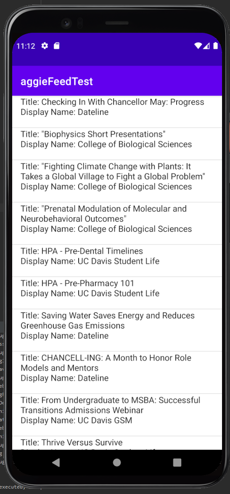
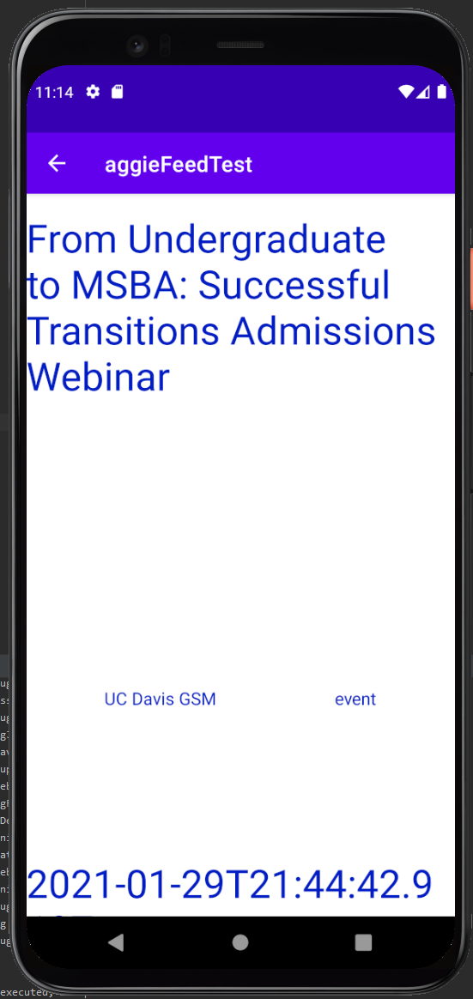

## Simple App for Aggie Feed API Data Retrieval

A simple service to access the AggieFeed REST API and display a Main Activity which lists all posts in a ViewList.
- Uses Request Queue for multiple API requests
- Uses Callback to handle background execution thread  

### Specifications

* The Android app should have two Activities.
  1) The main activity should hold a ListView, which shows the result from a RESTful
data call when app loads
      * Data API: https://aggiefeed.ucdavis.edu/api/v1/activity/public?s=0?l=25
      * The above REST GET call will return 25 aggiefeed activities that are
      public
      * Each ListView item should show the following activity properties:
        * title
        * actor.displayName

  2) The user should be able to tap on any ListView item which should launch a
  second activity, showing the detailed view of the data the user has selected.
      * The detail view should show the following activity properties:
        * title
        * actor.displayName
        * object.objectType
        * published

* When the user clicks on the Android main navigation back button, the user should be
presented with the main activity (ListView) again.

Each item has a on click handler to send the user to an Activity showing a more detailed View of the data.

